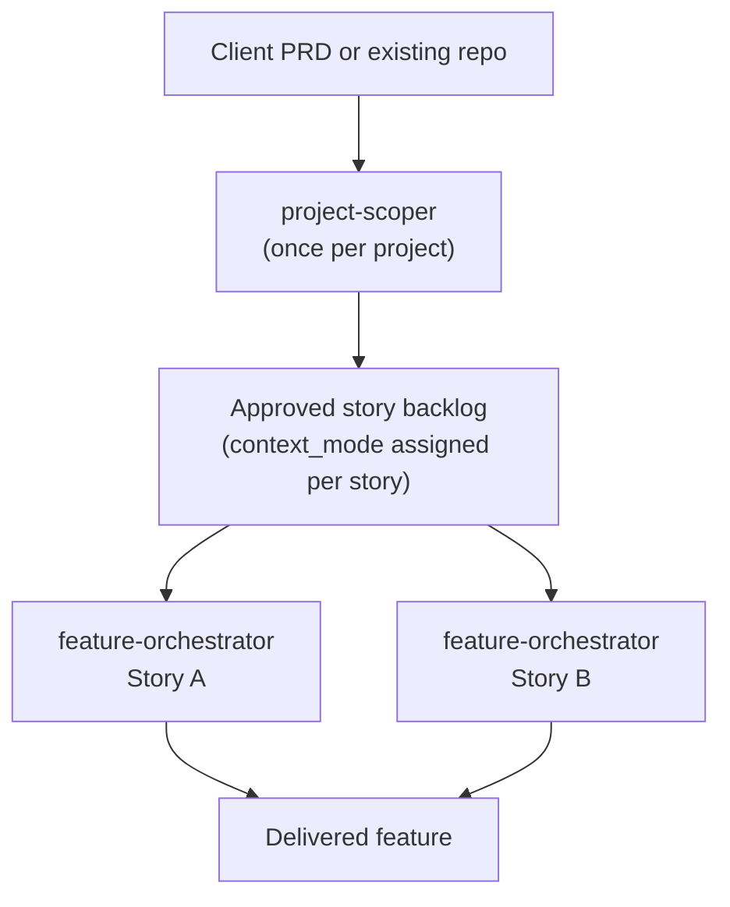
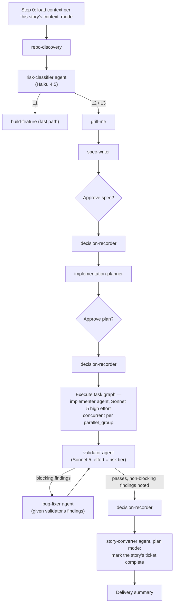
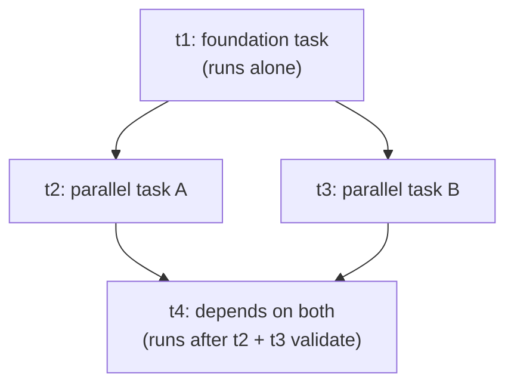
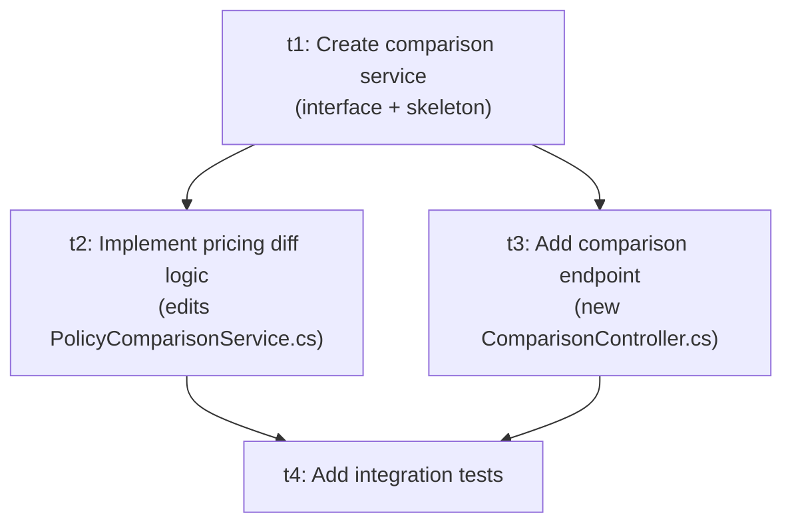

# agentic-sdlc-core — How It Works

A two-tier, multi-agent orchestration layer for AI-assisted software development, built on Claude Code skills and subagents. This document explains the architecture, how to set it up in a project, how to use it day to day, and walks through one feature end to end.

---

## 1. What this is

Most AI-assisted development setups automate one loop: describe a feature, get code back. This system automates two nested loops instead, because real projects have two different scales of planning:

- **Program scoping** — turning a client's PRD, or an existing repo that needs new work, into a backlog of well-defined stories. Happens once per project.
- **Story execution** — turning one approved story into a spec, a plan, working code, and a validated delivery. Happens once per story, often picked up by a different engineer than the one who scoped the project.

The same pattern — discover the codebase, clarify with a human, write a spec, break it into units of work — runs at both scales. That's deliberate: it means the story-level machinery didn't need to be reinvented for the program level, just wrapped with an entry point.



---

## 2. Skills and agents

Two different primitives, deliberately not interchangeable. **Skills** run inline in the calling session — no isolation, full access to whatever's already in context. **Agents** are fixed-identity subagents: always isolated in a fresh context, always on a pinned model, invoked with explicit input and returning a single result.

| Name | Type | Tier | Role |
|---|---|---|---|
| `project-scoper` | Skill | Program | Entry point for a new project — turns a PRD or existing repo into an approved story backlog |
| `feature-orchestrator` | Skill | Story | Entry point for one story — controls the full spec → plan → implement → validate workflow |
| `build-feature` | Skill | Story | Lightweight fast path for low-risk (L1) stories — single scope confirmation instead of the full chain |
| `repo-discovery` | Skill | Both | Analyzes the codebase — broad pass at program scoping, focused pass per story |
| `risk-classifier` | **Agent** | Story | Classifies work as L1 / L2 / L3 and determines how much rigor the story needs. Haiku 4.5 |
| `grill-me` | Skill | Both | Interviews the user to resolve ambiguity — scope-defining at program level, feature-defining at story level. Interactive, so it can't be an agent: a subagent runs autonomously and returns one result, with no way to pause and take a turn with the actual person |
| `spec-writer` | Skill | Both | Produces the spec — program-level scope spec, or a story-level implementation spec |
| `implementation-planner` | Skill | Story | Converts an approved spec into a task graph: `depends_on`, `parallel_group`, `files_touched` per task |
| `implementer` | **Agent** | Story | Implements exactly one task, scoped strictly to its declared `files_touched`. Always isolated, always Sonnet 5, high effort — no conditional inline path |
| `validator` | **Agent** | Story | Checks acceptance criteria, conventions, and regressions, and code-reviews the diff for security, performance, and code quality — findings tagged blocking or non-blocking. Sonnet 5; effort scales with risk tier (low/medium/high) |
| `bug-fixer` | **Agent** | Story | Diagnoses and fixes a failing check with a minimal, targeted change. Given validator's structured findings explicitly when one exists. Sonnet 5; effort scales with risk tier (low/medium/high), medium as the bug-fix-only workflow's fixed default |
| `story-converter` | **Agent** | Both | The only place tickets get created — spec mode, once, by `project-scoper`. Plan mode only ever updates that same ticket, and only when `feature-orchestrator` has a scope amendment, a story amendment, or a completion to report. Haiku 4.5 |
| `decision-recorder` | Skill | Both | Appends one JSONL line to the shared, append-only decision log — written unconditionally regardless of a story's `context_mode`. Runs inline: invoked more often than anything else here (3+ times per story plus every amendment), and its job is capturing reasoning that just happened in the calling session, which isolation would only make worse. Log growth is kept in check separately, by `scripts/rotate-decision-log.ps1` |
| `context-compressor` | Skill | Story | Compresses accumulated context to control token usage on long-running stories. Must run inline — it has to see the live session context to compress it, so it can't be an agent either. Haiku 4.5 as a best-effort preference |

Not included in this core: `zoom-out` and `caveman`-style personal tools belong at the user level (`~/.claude/skills/`), not versioned into a project.

---

## 3. Setup

### Prerequisites

- Claude Code, with `git` available on `PATH`
- A repo to install into (the script expects to run from a repo root, though it will ask before continuing if `.git` isn't found)

### Install

From the root of the target project:

```powershell
.\install.ps1 -RepoUrl "https://github.com/<org>/agentic-sdlc-core.git" -Ref "v5.4.1"
```

This installs:

```
<project>/.claude/
├── skills/                       # 9 skills — always synced to -Ref
├── agents/                       # 5 subagents — always synced to -Ref
├── schemas/                      # task-graph, story-backlog, decision-log schemas
├── scripts/                      # rotate-decision-log.ps1, export-adrs.ps1, token-usage-report.ps1, setup-mcp-server.ps1 — always synced to -Ref
├── mcp-servers/                  # only present if state_backend: turso (or similar) is set — see below
│   └── turso-state/              # fetched + npm installed by setup-mcp-server.ps1, not vendored unconditionally
├── agentic-sdlc-core.version     # records repo/ref/commit installed
├── CLAUDE.md                     # this project's architecture/conventions (scaffolded once)
├── config/
│   └── orchestration.yaml        # this project's settings (scaffolded once)
└── state/
    ├── README.md                 # what's in state/ and how rotation works (scaffolded once)
    ├── decision-log.jsonl        # append-only JSONL, committed
    ├── decision-log-archive/     # rotated-out entries, one file per rotation run
    ├── story-backlog.json        # written once by story-converter (spec mode)
    └── stories/                  # default location - one folder per story; actual
                                   # path comes from stories_dir in orchestration.yaml
```

`skills/`, `agents/`, `schemas/`, and `scripts/` are always overwritten with whatever `-Ref` points to — they're core, and a re-run is how a project takes an update. `CLAUDE.md` and `state/` are only created if missing, so re-running the script to pick up a newer core version never clobbers those. Pass `-Force` if you deliberately want those reset from the template too. `config/orchestration.yaml` is different: if it already exists, it's never overwritten (not even with `-Force`) but any top-level property present in the new version and missing from yours gets appended, comments included — existing values are never touched.

### Configure

Fill in `.claude/config/orchestration.yaml`:

```yaml
agentic_sdlc_core_version: "5.4.1"
context_mode_default: decision-log-only
risk_thresholds:
  l1_max_files: 1
  l1_excludes: [auth, payments, migrations]
ticket_system:
  provider: jira
  project_key: YOUR_KEY
state_dir: .claude/state
stories_dir: .claude/state/stories
```

Fill in `.claude/CLAUDE.md` with this project's architecture, conventions, and domain glossary — this is prose the skills and agents read, not settings they branch on, so keep structured decisions in `orchestration.yaml` instead.

**Commit `.claude/state/` as part of each story's normal work**, on that story's own branch, merged via its own PR — no separate fast path, same review process as the code changes it sits alongside. That means state becomes visible to other stories exactly when the PR merges, not before. This mostly doesn't matter: two *sequential* stories are fine, since by the time the second starts the first has already merged. Two *concurrent* stories (both open at once, neither merged) genuinely won't see each other's decisions until one lands — but that's an acceptable, bounded cost, not something to engineer around. `depends_on` is reserved for genuine contract dependencies only (this story consumes an API another story builds) — it's not used for "might benefit from awareness," because sequencing stories on that basis at scoping time, before any story-specific work has happened, degrades parallel development badly across a real backlog. The awareness case is handled differently: see Context escalation below.

---

## 4. How to use it

### Starting a new project

Run `project-scoper` with a PRD, an existing repo, or both. It:

1. Runs `repo-discovery` (broad pass, brownfield only) and reads any provided PRD.
2. Runs a `grill-me` session — scope-defining by default (what's in scope, what's explicitly out, constraints, priorities), or a deeper architecture-mode session if you asked for one (see below). **Stops for your approval.**
3. Writes a program-level spec via `spec-writer` — high-level on API/database detail by default, or fully specified if architecture mode produced that detail. **Stops for your approval.**
4. Invokes `decision-recorder` to record scope decisions.
5. Delegates to the `story-converter` agent in **spec mode**, producing a backlog: each story gets acceptance criteria and a `context_mode` (see below), one ticket per story in the configured tracker, and the whole backlog written locally to `.claude/state/story-backlog.json`. **Stops for your approval.**

Each approved story is then handed off as an independent `feature-orchestrator` run — to you, or to a different engineer.

**Architecture mode** is off by default, and only turns on when you explicitly ask for it at invocation — `project-scoper` doesn't infer it from the PRD or from what `repo-discovery` finds. On, it changes steps 2 and 3 above: `grill-me` goes deep on service boundaries, data ownership, and integration patterns instead of staying scope-level, and `spec-writer` writes that detail into the program spec now instead of deferring it per-story. Worth it for genuinely greenfield or multi-service work, where a story-by-story approach to those decisions risks one story's implementation conflicting with a boundary an earlier story assumed. Not worth it for a bounded feature on a well-understood system — the default light-touch scoping already covers that well.

Neither `grill-me` nor `spec-writer` changed to support this — the constraint that normally keeps them at scope level lives entirely in how `project-scoper` instructs them each run, not in either skill's own file, so architecture mode is really just `project-scoper` telling them something different, not new capability elsewhere. Whether it was on for a project persists on the backlog itself (`architecture_mode` in `story-backlog.schema.json`), and `story-converter` weighs it toward more stories defaulting to `full-spec` context_mode.

### Working a story

`feature-orchestrator` is the entry point. Its full flow:



**Risk-driven branching.** The `risk-classifier` agent isn't advisory — L1 work (isolated fixes, config, styling) actually routes to `build-feature`, a single scope-confirmation and a direct implement → validate, skipping the full ceremony. L2/L3 work goes through the complete chain.

**L1 has a project-configurable floor, not just categorical judgment.** `risk-classifier` has no access to project config itself, so `feature-orchestrator` passes `orchestration.yaml`'s `risk_thresholds` explicitly on every call. `l1_excludes` is absolute - a project's own sensitive areas (beyond whatever's already hardcoded as L3 in `risk-classifier.md`) never get L1, no matter how simple the change looks. `l1_max_files` is a strong signal rather than a mechanical gate - exceeding it should usually rule out L1, but the agent can still classify L1 if it explicitly justifies why in its returned `reasons`, rather than a config number silently overriding judgment either way.

**`validator` and `bug-fixer` are both agents, for the same reason.** Each is given everything it needs as explicit input — `validator` gets the diff, the approved spec, the approved plan, and acceptance criteria; `bug-fixer` gets `validator`'s structured findings (failed checks, recommended fixes) when a prior review exists, or the bug report itself when it doesn't (the bug-fix-only workflow). Neither has access to this session's history at all, by construction, not just by instruction. A reviewer with no memory of how the code got built catches more than one reviewing its own work, the same reason human teams avoid self-review — and a fixer acting on a diagnosis it was actually handed, rather than one it has to rediscover from a shared conversation, gets the same benefit.

**`validator` reviews the diff, not just the checklist.** Beyond acceptance criteria and conventions, it explicitly checks the actual code for security (injection, auth, secrets, unsafe deserialization), performance (N+1s, unnecessary allocations, blocking calls), and code quality (naming, duplication, complexity). Findings are tagged blocking or non-blocking — only blocking ones trigger `bug-fixer`; non-blocking ones ride along into the delivery summary rather than forcing an automatic fix cycle over something like a naming nit.

**Review depth scales with risk, not a flat setting.** `feature-orchestrator` passes an explicit effort level on every call — low for L1 (via `build-feature`), medium for L2, high for L3 — based on the risk tier `risk-classifier` already determined at step 2. `validator` has no session history, so it can't infer this itself; it always comes from the caller. This is the same lesson `risk-classifier` taught earlier in this system's history: computing a risk tier and then applying the same fixed rigor regardless of it wastes the classification.

**One ticket per story, created once.** The `story-converter` agent only ever creates a ticket in spec mode, at `project-scoper` time — there's no per-task ticket layer, and no routine ticket step inside `feature-orchestrator`. Plan mode exists solely to update that one ticket, and only fires from three places: a scope amendment, a story amendment, or the completion sync above. The task graph that drives execution stays internal to `plan.json` — it's not mirrored into the tracker.

**The task graph drives execution, not a linear list.** `implementation-planner`'s output is a graph, not an ordered checklist:



A task starts only once everything in its `depends_on` list has passed validation. Tasks sharing a `parallel_group` run as separate concurrent implementer agent calls, explicitly on Sonnet 5 at high effort — safe only because the planner enforces that tasks sharing a group have fully disjoint `files_touched`, and genuinely concurrent rather than sequential turns labeled parallel because each is its own isolated call. Tasks with `parallel_group: null` run the same way, just one at a time instead of concurrently — isolation and model tier are constant regardless of whether a task has company. `implementer` itself is scoped to exactly one task id and its declared files; it's not authorized to touch anything else.

Earlier versions of this system made isolation conditional on `parallel_group`, letting solo tasks run inline to skip the cost of re-establishing context. That traded a real, immediate cost — solo tasks silently inheriting whatever model the orchestrator's session happened to be on, and a weaker `files_touched` boundary since everything in a shared session stays technically reachable — for a theoretical savings that was never actually measured. Reverted to always-isolated until real cost telemetry justifies bringing the conditional path back.

### `context_mode`: three settings, one guarantee

Assigned per story by the `story-converter` agent when the backlog is created — a reasonable starting guess made before any story-specific work has happened, not a permanent commitment. If it turns out to be wrong, context escalation (below) corrects it mid-run, without blocking anything:

| Mode | What a story's `feature-orchestrator` run loads at step 0 |
|---|---|
| `full-spec` | The whole program-level spec — for stories touching shared/foundational surface |
| `decision-log-only` | Just the shared decision log — enough awareness without full context |
| `independent` | Neither — fully self-contained |

The guarantee that holds regardless of mode: **every story writes to the decision log unconditionally.** `context_mode` controls what a story reads on the way in, never what it contributes on the way out — so choosing `independent` for a self-contained story never creates a blind spot for whoever reads the log later.

### When things change mid-story: two amendment loops, and a context escalation

**Scope amendment loop** — `implementer` needs a file outside its declared `files_touched`:

1. Record the gap (task id, file needed, why).
2. Re-invoke `implementation-planner` scoped to just that gap.
3. Re-check the parallel-safety rule — a new file might now collide with a sibling task in the same `parallel_group`; resequence if so.
4. One-line approval, not a full plan re-approval.
5. Delegate to the `story-converter` agent to note the amended scope on the story's ticket — a short delta, not a restatement.
6. Delegate to the `implementer` agent again on the task with its amended `files_touched`. This is a fresh call reading the task's current on-disk state, not a literal resume of a paused process — whatever was already built is sitting in the files themselves, so nothing needs to carry over in memory.

**Story amendment loop** — acceptance criteria change after the spec was approved:

1. Record the delta.
2. Re-invoke `spec-writer` to amend the spec.
3. If a plan exists, re-invoke `implementation-planner` to patch it (same parallel-safety re-check).
4. Flag explicitly if already-implemented work now conflicts — never silently rework it.
5. Invoke `decision-recorder` unconditionally, regardless of `context_mode`.
6. Delegate to the `story-converter` agent to reflect the new criteria on the story's ticket — what changed and why.
7. One-line approval for the delta.

**Context escalation** — a story's assigned `context_mode` (`independent` or `decision-log-only`) turns out not to be enough, usually surfacing during `grill-me` or `spec-writer`:

1. Escalate upward only — `independent`/`decision-log-only` → `full-spec` — and never back down once escalated.
2. Load the program spec via the backlog's `program_spec_ref`. No branch-visibility problem here, unlike `.claude/state/` generally: `project-scoper` writes this before any story branches even exist, so it's already on `main`.
3. No approval gate — this changes what informs a decision, not what gets built, unlike the two loops above.
4. `decision-recorder` logs it, including *why*. That's the useful signal: if `decision-log-only` stories keep escalating, `story-converter`'s initial tiering isn't earning its keep.

`context_mode` is a reasonable starting guess made before any story-specific work has happened, not a commitment — this is what corrects a wrong guess without ever blocking the story on it.

Both amendment loops patch forward rather than restarting the story; the escalation doesn't restart anything either — it just widens what the rest of the run can see.

### Sharing state across concurrent engineers (optional Turso backend)

By default (`state_backend: file`), `story-backlog.json` and `decision-log.jsonl` are plain files, read and written directly - fine for one engineer, but each of several engineers' feature branches ends up with its own copy once more than one is running `feature-orchestrator` at the same time. `decision-log.jsonl`'s id assignment in particular is a real read-then-increment race under that concurrency, not just a merge inconvenience.

Setting `state_backend: turso` in `orchestration.yaml` routes `story-backlog.json`/`decision-log.jsonl` reads and writes through `.claude/mcp-servers/turso-state/`, a local MCP server backed by a hosted Turso (libSQL) database instead. `decision-recorder`, `story-converter` (spec mode), and `feature-orchestrator` all branch on this setting internally - nothing else about how you invoke them changes. Everything under `stories_dir` stays a plain file in both modes; it was never the part of `.claude/state/` with a concurrency problem.

`install.ps1` never reads `state_backend` or touches `.mcp.json` itself - installing the orchestrator and setting up an MCP server are two separate, deliberate steps, whether or not `state_backend: turso` was already set before you ran `install.ps1` for the first time. Once you've set it, run:

```powershell
.claude\scripts\setup-mcp-server.ps1 -Name turso-state -EnvVars @{
    TURSO_DATABASE_URL = "libsql://<db-name>-<org>.turso.io"
    TURSO_AUTH_TOKEN   = "<your actual token>"
}
```

This fetches `mcp-servers/turso-state/dist/` at whatever ref `.claude/agentic-sdlc-core.version` has pinned, runs `npm install` for its runtime-only dependencies, and registers it in `.mcp.json`. The two values above are never written into `.mcp.json` - they're written once to `.claude/mcp-servers/turso-state.env.local` (a sibling of `.claude/mcp-servers/turso-state/`, so a later re-run to pick up a newer build never touches it), which `setup-mcp-server.ps1` also adds to this project's `.gitignore`. `turso-state` loads that file itself at startup. Re-run the script any time you need a newer build - it's always a clean sync of the server itself, but `.env.local` is only ever written once; edit it directly if a value needs to change.

This is opt-in and off by default - only turn it on once real concurrent-branch contention on this state is an actual, not hypothetical, problem for your team. See `docs/features/specs/2026-09-11-turso-state-backend-design.md` in agentic-sdlc-core for the full design, including the export mechanism that keeps `rotate-decision-log.ps1`/`export-adrs.ps1` working unmodified against a `turso`-backed project.

### Updating a project's core version

Re-run `install.ps1` with a new `-Ref`. Skills, agents, schemas, and scripts sync to the new version; your decision log is untouched. `orchestration.yaml` picks up any new top-level properties the new version added, with your existing values left exactly as they were - so a config addition like `stories_dir` (7.2.0) or `risk_thresholds` (7.1.0) actually reaches projects that installed before those existed, not just fresh installs.

### Keeping the decision log from growing unbounded

`decision-log.jsonl` only ever grows — every story that loads it via `context_mode` pays for its entire history, not just the part relevant to that story. `scripts/rotate-decision-log.ps1` addresses this, run manually and periodically rather than automatically:

```powershell
.claude/scripts/rotate-decision-log.ps1
```

It keeps the most recent entries in the hot log — bounded by both an age cutoff (default 6 months) and a max count (default 200), whichever an entry crosses first — and moves everything else into `state/decision-log-archive/<date>.jsonl`, stripping `reasoning`, `alternatives_considered`, and `tradeoffs` on the way out. `id`, `date`, `story_id`, `decision`, and `consequences` survive rotation; those five fields are what a story reading the log later actually needs, not the deliberation that produced them. A rotation breadcrumb gets appended to the hot log noting what moved and where, continuing the same `DEC-####` id sequence rather than resetting it.

Archives aren't loaded by any `context_mode` automatically — they're a manual lookup for the rare case something needs older history, the same "narrow by default, widen only with reason" shape as `context_mode` itself. Run with `-DryRun` first to see what a rotation would do before it writes anything.

### Getting ADRs out of the decision log

Nothing new to write — the decision log already captures decisions in the same shape an ADR needs (`context`/`decision`/`reasoning`/`alternatives_considered`/`consequences`/`tradeoffs`). What was missing was marking which entries are ADR-worthy and rendering them into the per-file format most ADR tooling expects. `decision-recorder` now accepts a `significance` tag (`architectural` or `routine`, defaulting to `routine`) from whichever skill invokes it — the caller has the context to judge this, `decision-recorder` itself doesn't.

```powershell
.claude/scripts/export-adrs.ps1
```

Filters the hot log for `significance: architectural` and writes one Markdown file per entry to `docs/adr/`, named by the entry's own `DEC-####` id so it always traces back to the exact log line. This is a projection, not a second source of truth — re-running it regenerates all ADR files from current log content, and a correction belongs as a new log entry, not a hand-edit of a generated file. Pass `-IncludeArchive` to also render architectural entries that have already been rotated out of the hot log.

### Checking token usage per skill/agent

```powershell
.claude/scripts/token-usage-report.ps1
```

Reads the Claude Code session transcript for the current project and renders a terminal bar chart of token usage, one row per agent and per skill. The transcript is written incrementally while a session is open, so this can be run from a second terminal against a session that's still running — not just a finished one — and pointed at an older one with `-SessionId`, or listed with `-List`.

Agent totals are exact: each isolated agent invocation completes with a single pre-aggregated token figure the harness already computes, tied back to the invoking `subagent_type`. Skill totals are a best-effort heuristic, labelled as such in the output — skills run inline with no isolation boundary, so a skill invocation only marks where attribution starts, not where it ends. Usage that isn't inside any skill span prints as `orchestrator (unattributed)` rather than being dropped, so the totals always reconcile with the session's real usage. No new state is written by default — like `export-adrs.ps1`, this is a disposable projection of data that already exists; the transcript stays the only source of truth.

Add `-Html` for a presentable version of the same data — colored stacked bar charts (Input Tokens / Output Tokens / Cache Read Input Tokens / Cache Creation Input Tokens as a legend-backed series, colors validated for colorblind-safety and contrast via the `dataviz` skill), light/dark themes, hover tooltips, and a table view:

```powershell
.claude/scripts/token-usage-report.ps1 -Html
```

Writes to `.claude/analytics/token-usage-report-<session-id>-<timestamp>.html` by default (created if missing), or wherever `-HtmlPath` points. Unlike the rest of `.claude/state/`, these files are timestamped and disposable — regenerate anytime from the transcript. `install.ps1` adds `.claude/analytics/` to the project's `.gitignore` automatically, but only if that project already has one — it won't create a `.gitignore` a project never chose to have. If you installed before this existed, or your project has no `.gitignore`, add the line yourself.

---

## 5. Practical example

A client asks for a **policy comparison feature**: compare 2–3 policies side by side, highlighting price and coverage differences. The target repo already exists (brownfield).

### Program scoping

`project-scoper` runs `repo-discovery` over the existing repo and finds the current `PolicyController`. A `grill-me` session settles the boundary: comparison only, no AI-driven recommendation (out of scope). `spec-writer` produces the program spec, and `decision-recorder` logs the decision that matters most for everything downstream: **comparison logic lives in a new `PolicyComparisonService`, not bolted onto the existing controller.**

The `story-converter` agent (spec mode) splits the spec into two stories, creating one ticket for each:

| Story | `context_mode` | Why |
|---|---|---|
| A: comparison API | `full-spec` | Owns the shared service — needs full program context |
| B: comparison UI | `decision-log-only` | Just needs to know the API contract exists |

### Story A: comparison API

A different engineer picks this up as an independent `feature-orchestrator` run. `context_mode: full-spec` means step 0 loads the program spec. The `risk-classifier` agent returns L2 (new service, no auth/migrations) — full chain, not the L1 fast path. `implementation-planner` produces:



`t1` runs alone. `t2` and `t3` then run as separate concurrent calls to the implementer agent — safe because they touch disjoint files. `t4` waits for both.

Partway through `t3`, the implementer agent discovers it also needs a `PolicyComparisonDto.cs` that wasn't in its declared `files_touched`. **Scope amendment loop:** the gap is reported, `implementation-planner` patches `t3`'s file list, confirms the new file doesn't collide with `t2`'s, gets a one-line approval, the `story-converter` agent notes the amended scope on Story A's ticket, and `t3` continues with a fresh call against the amended `files_touched`.

### Story B: comparison UI

Runs in parallel, by a different engineer. `context_mode: decision-log-only` means step 0 loads just the shared log — enough to know comparison logic lives in `PolicyComparisonService`, without the full program spec.

During `grill-me`, the engineer hits a question the decision log doesn't answer: should the comparison UI show currency conversion, or assume a single currency throughout? That's a program-scoping question, not something Story A's decisions happened to cover. **Context escalation:** `context_mode` escalates to `full-spec`, the program spec confirms single-currency was the assumption all along, `decision-recorder` logs the escalation and why, and `grill-me` continues with the answer in hand — no approval needed, since nothing about what gets built changed, only what informed the answer.

Partway through implementation, the client adds a requirement: highlight coverage differences in green/red, not just price. **Story amendment loop:** `spec-writer` amends Story B's spec, `implementation-planner` adds a task for the new UI logic, `decision-recorder` logs it — *unconditionally*, even though this story is now `full-spec` — the `story-converter` agent reflects the new criteria on Story B's ticket, and a lightweight approval lets the implementer agent continue.

Two log writes worth noticing for different reasons: the escalation shows `context_mode` correcting a guess that turned out too narrow, made before either story's actual work had started. The story-amendment write makes the same point the Scope amendment loop made for Story A — the log capturing a decision regardless of what got the story there, so a third story added later would see it on the way in either way.

### Delivery

Both stories finish; the `validator` agent passes each — Story A at medium effort, matching the L2 tier established earlier — and the `story-converter` agent marks each story's one ticket complete. What actually happened underneath: one program-level scoping pass, two engineers working genuinely in parallel on disjoint files with no coordination meeting, one mid-flight requirement change handled without derailing the other story, and a decision log that ended up doing the real work of keeping two people — who never talked to each other about this feature — consistent with each other.

---

## 6. Reference

- Schemas: `schemas/task-graph.schema.json`, `schemas/story-backlog.schema.json`, `schemas/decision-log.schema.json`
- Full skill definitions: `skills/<name>/SKILL.md`
- Full agent definitions: `agents/<name>.md`
- Maintenance scripts: `scripts/rotate-decision-log.ps1`, `scripts/export-adrs.ps1`, `scripts/token-usage-report.ps1`
- MCP server setup: `scripts/setup-mcp-server.ps1 -Name <name>`
- What changed between core versions: `CHANGELOG.md`
