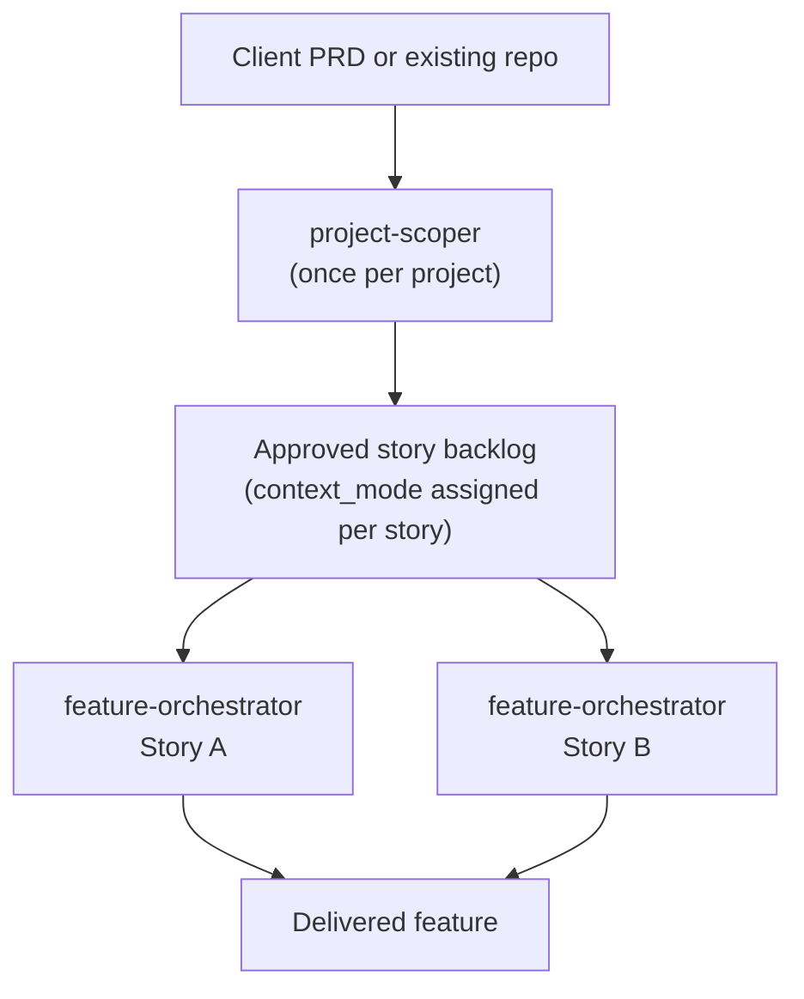
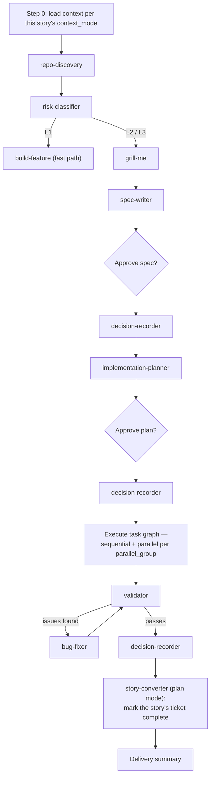
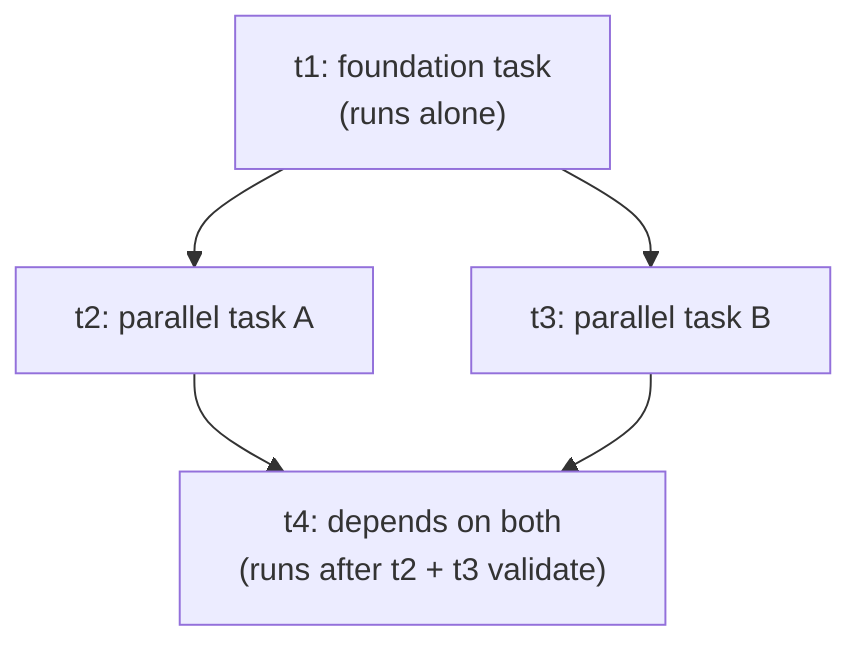
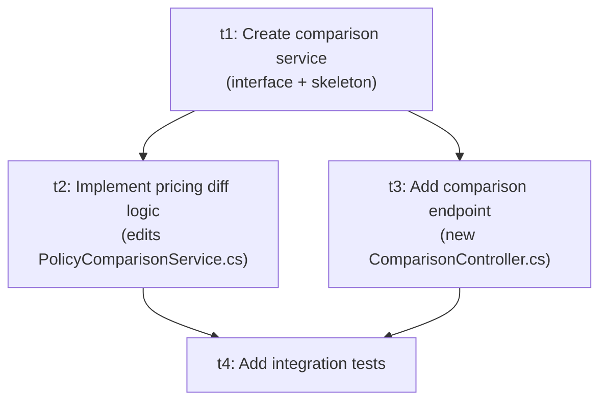

# agentic-sdlc-core — How It Works

A two-tier, multi-agent orchestration layer for AI-assisted software development, built on Claude Code skills. This document explains the architecture, how to set it up in a project, how to use it day to day, and walks through one feature end to end.

---

## 1. What this is

Most AI-assisted development setups automate one loop: describe a feature, get code back. This system automates two nested loops instead, because real projects have two different scales of planning:

- **Program scoping** — turning a client's PRD, or an existing repo that needs new work, into a backlog of well-defined stories. Happens once per project.
- **Story execution** — turning one approved story into a spec, a plan, working code, and a validated delivery. Happens once per story, often picked up by a different engineer than the one who scoped the project.

The same pattern — discover the codebase, clarify with a human, write a spec, break it into units of work — runs at both scales. That's deliberate: it means the story-level machinery didn't need to be reinvented for the program level, just wrapped with an entry point.



---

## 2. The skill set

| Skill | Tier | Role |
|---|---|---|
| `project-scoper` | Program | Entry point for a new project — turns a PRD or existing repo into an approved story backlog |
| `feature-orchestrator` | Story | Entry point for one story — controls the full spec → plan → implement → validate workflow |
| `build-feature` | Story | Lightweight fast path for low-risk (L1) stories — single scope confirmation instead of the full chain |
| `repo-discovery` | Both | Analyzes the codebase — broad pass at program scoping, focused pass per story |
| `risk-classifier` | Story | Classifies work as L1 / L2 / L3 and determines how much rigor the story needs |
| `grill-me` | Both | Interviews the user to resolve ambiguity — scope-defining at program level, feature-defining at story level |
| `spec-writer` | Both | Produces the spec — program-level scope spec, or a story-level implementation spec |
| `implementation-planner` | Story | Converts an approved spec into a task graph: `depends_on`, `parallel_group`, `files_touched` per task |
| `implementer` | Story | Implements exactly one task, scoped strictly to its declared `files_touched` |
| `validator` | Story | Checks an implementation against acceptance criteria, conventions, and regressions |
| `bug-fixer` | Story | Diagnoses and fixes a failing check with a minimal, targeted change |
| `story-converter` | Both | The only place tickets get created — spec mode, once, by `project-scoper`. Plan mode only ever updates that same ticket, and only when `feature-orchestrator` has a scope amendment, a story amendment, or a completion to report |
| `decision-recorder` | Both | Records architecture/scope decisions to a shared, append-only log — written unconditionally regardless of a story's `context_mode` |
| `context-compressor` | Story | Compresses accumulated context to control token usage on long-running stories |

Not included in this core: `zoom-out` and `caveman`-style personal tools belong at the user level (`~/.claude/skills/`), not versioned into a project.

---

## 3. Setup

### Prerequisites

- Claude Code, with `git` available on `PATH`
- A repo to install into (the script expects to run from a repo root, though it will ask before continuing if `.git` isn't found)

### Install

From the root of the target project:

```powershell
.\install.ps1 -RepoUrl "https://github.com/<org>/agentic-sdlc-core.git" -Ref "v2.0.0"
```

This installs:

```
<project>/.claude/
├── skills/                       # all 14 skills — always synced to -Ref
├── schemas/                      # task-graph, story-backlog, decision-log schemas
├── agentic-sdlc-core.version     # records repo/ref/commit installed
├── CLAUDE.md                     # this project's architecture/conventions (scaffolded once)
├── config/
│   └── orchestration.yaml        # this project's settings (scaffolded once)
└── state/
    ├── decision-log.md           # append-only, committed
    └── stories/                  # one folder per story once work starts
```

`skills/` and `schemas/` are always overwritten with whatever `-Ref` points to — they're core, and a re-run is how a project takes an update. `CLAUDE.md`, `config/orchestration.yaml`, and `state/` are only created if missing, so re-running the script to pick up a newer core version never clobbers project-specific config or the decision log. Pass `-Force` if you deliberately want those reset from the template too.

### Configure

Fill in `.claude/config/orchestration.yaml`:

```yaml
agentic_sdlc_core_version: "2.0.0"
context_mode_default: decision-log-only
risk_thresholds:
  l1_max_files: 1
  l1_excludes: [auth, payments, migrations]
ticket_system:
  provider: jira
  project_key: YOUR_KEY
state_dir: .claude/state
```

Fill in `.claude/CLAUDE.md` with this project's architecture, conventions, and domain glossary — this is prose the skills read, not settings they branch on, so keep structured decisions in `orchestration.yaml` instead.

**Commit `.claude/state/` as work progresses**, not just at the end. A different engineer's story run depends on being able to read the decision log and sibling stories' state — if it only ever existed in someone's local chat session, the cross-story consistency this system is built around silently stops working.

---

## 4. How to use it

### Starting a new project

Run `project-scoper` with a PRD, an existing repo, or both. It:

1. Runs `repo-discovery` (broad pass, brownfield only) and reads any provided PRD.
2. Runs a scope-defining `grill-me` session — what's in scope, what's explicitly out, constraints, priorities. **Stops for your approval.**
3. Writes a program-level spec via `spec-writer`. **Stops for your approval.**
4. Records scope decisions via `decision-recorder`.
5. Runs `story-converter` in **spec mode**, producing a backlog: each story gets acceptance criteria and a `context_mode` (see below). **Stops for your approval.**

Each approved story is then handed off as an independent `feature-orchestrator` run — to you, or to a different engineer.

### Working a story

`feature-orchestrator` is the entry point. Its full flow:



**Risk-driven branching.** `risk-classifier` isn't advisory — L1 work (isolated fixes, config, styling) actually routes to `build-feature`, a single scope-confirmation and a direct implement → validate, skipping the full ceremony. L2/L3 work goes through the complete chain.

**One ticket per story, created once.** `story-converter` only ever creates a ticket in spec mode, at `project-scoper` time — there's no per-task ticket layer, and no routine ticket step inside `feature-orchestrator`. Plan mode exists solely to update that one ticket, and only fires from three places: a scope amendment, a story amendment, or the completion sync above. The task graph that drives execution stays internal to `plan.json` — it's not mirrored into the tracker.

**The task graph drives execution, not a linear list.** `implementation-planner`'s output is a graph, not an ordered checklist:



A task starts only once everything in its `depends_on` list has passed validation. Tasks sharing a `parallel_group` run as separate concurrent `implementer` sessions — safe only because the planner enforces that tasks sharing a group have fully disjoint `files_touched`. `implementer` itself is scoped to exactly one task id and its declared files; it's not authorized to touch anything else.

### `context_mode`: three settings, one guarantee

Assigned per story by `story-converter` when the backlog is created:

| Mode | What a story's `feature-orchestrator` run loads at step 0 |
|---|---|
| `full-spec` | The whole program-level spec — for stories touching shared/foundational surface |
| `decision-log-only` | Just the shared decision log — enough awareness without full context |
| `independent` | Neither — fully self-contained |

The guarantee that holds regardless of mode: **every story writes to the decision log unconditionally.** `context_mode` controls what a story reads on the way in, never what it contributes on the way out — so choosing `independent` for a self-contained story never creates a blind spot for whoever reads the log later.

### When things change mid-story: two amendment loops

**Scope amendment loop** — `implementer` needs a file outside its declared `files_touched`:

1. Record the gap (task id, file needed, why).
2. Re-invoke `implementation-planner` scoped to just that gap.
3. Re-check the parallel-safety rule — a new file might now collide with a sibling task in the same `parallel_group`; resequence if so.
4. One-line approval, not a full plan re-approval.
5. Note the amended scope on the story's ticket via `story-converter` — a short delta, not a restatement.
6. Resume `implementer` with the amended scope.

**Story amendment loop** — acceptance criteria change after the spec was approved:

1. Record the delta.
2. Re-invoke `spec-writer` to amend the spec.
3. If a plan exists, re-invoke `implementation-planner` to patch it (same parallel-safety re-check).
4. Flag explicitly if already-implemented work now conflicts — never silently rework it.
5. `decision-recorder` writes unconditionally, regardless of `context_mode`.
6. Reflect the new criteria on the story's ticket via `story-converter` — what changed and why.
7. One-line approval for the delta.

Both loops patch forward rather than restarting the story.

### Updating a project's core version

Re-run `install.ps1` with a new `-Ref`. Skills and schemas sync to the new version; your project's config and decision log are untouched.

---

## 5. Practical example

A client asks for a **policy comparison feature**: compare 2–3 policies side by side, highlighting price and coverage differences. The target repo already exists (brownfield).

### Program scoping

`project-scoper` runs `repo-discovery` over the existing repo and finds the current `PolicyController`. A `grill-me` session settles the boundary: comparison only, no AI-driven recommendation (out of scope). `spec-writer` produces the program spec, and `decision-recorder` logs the decision that matters most for everything downstream: **comparison logic lives in a new `PolicyComparisonService`, not bolted onto the existing controller.**

`story-converter` (spec mode) splits the spec into two stories, creating one ticket for each:

| Story | `context_mode` | Why |
|---|---|---|
| A: comparison API | `full-spec` | Owns the shared service — needs full program context |
| B: comparison UI | `decision-log-only` | Just needs to know the API contract exists |

### Story A: comparison API

A different engineer picks this up as an independent `feature-orchestrator` run. `context_mode: full-spec` means step 0 loads the program spec. `risk-classifier` returns L2 (new service, no auth/migrations) — full chain, not the L1 fast path. `implementation-planner` produces:



`t1` runs alone. `t2` and `t3` then run as separate concurrent `implementer` sessions — safe because they touch disjoint files. `t4` waits for both.

Partway through `t3`, `implementer` discovers it also needs a `PolicyComparisonDto.cs` that wasn't in its declared `files_touched`. **Scope amendment loop:** the gap is reported, `implementation-planner` patches `t3`'s file list, confirms the new file doesn't collide with `t2`'s, gets a one-line approval, `story-converter` notes the amended scope on Story A's ticket, and `t3` resumes.

### Story B: comparison UI

Runs in parallel, by a different engineer. `context_mode: decision-log-only` means step 0 loads just the shared log — enough to know comparison logic lives in `PolicyComparisonService`, without the full program spec.

Partway through, the client adds a requirement: highlight coverage differences in green/red, not just price. **Story amendment loop:** `spec-writer` amends Story B's spec, `implementation-planner` adds a task for the new UI logic, `decision-recorder` logs it — *unconditionally*, even though this story is `decision-log-only` — `story-converter` reflects the new criteria on Story B's ticket, and a lightweight approval lets `implementer` resume.

That log write is the part worth noticing: Story B never loaded the full program spec, but the criteria change still lands in the shared log. If a third story touching this feature were added later, it would see that decision on the way in, regardless of its own `context_mode`.

### Delivery

Both stories finish; `validator` passes each, and `story-converter` marks each story's one ticket complete. What actually happened underneath: one program-level scoping pass, two engineers working genuinely in parallel on disjoint files with no coordination meeting, one mid-flight requirement change handled without derailing the other story, and a decision log that ended up doing the real work of keeping two people — who never talked to each other about this feature — consistent with each other.

---

## 6. Reference

- Schemas: `schemas/task-graph.schema.json`, `schemas/story-backlog.schema.json`, `schemas/decision-log.schema.json`
- Full skill definitions: `skills/<name>/SKILL.md`
- What changed between core versions: `CHANGELOG.md`
